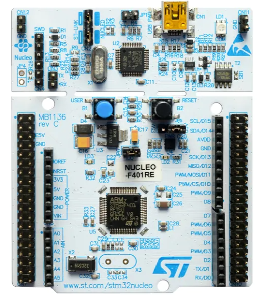

# STM32F446RE-drivers

  

# STM32F446RE

The STM32F446RE is a microcontroller from the STM32F4 series, manufactured by STMicroelectronics. It is based on the ARM Cortex-M4 core and offers a wide range of peripherals and features.

## Key Features

- Microcontroller: ARM Cortex-M4 core running at up to 180 MHz
- Flash Memory: 512 KB
- RAM: 128 KB
- Operating Voltage Range: 1.7V to 3.6V
- Operating Temperature Range: -40°C to +85°C
- GPIO: Up to 144 GPIO pins
- Timers: Advanced-control Timer, General-purpose Timers, and Basic Timers
- Communication Interfaces: UART, SPI, I2C, CAN, USB
- Analog-to-Digital Converter (ADC): 12-bit, up to 16 channels
- Digital-to-Analog Converter (DAC): 12-bit, up to 2 channels
- Real-Time Clock (RTC): With backup registers and tamper detection

## Development Tools

- Development Boards: There are various development boards available for the STM32F446RE, such as the Nucleo-F446RE and Discovery Kit boards. These boards provide easy access to the microcontroller's features and are equipped with built-in debuggers.
- IDEs and Toolchains: The STM32CubeIDE and Keil MDK are popular development environments for STM32 microcontrollers. These IDEs provide code editing, debugging, and project management capabilities. Additionally, the GCC toolchain can be used for bare-metal programming.
- Software Libraries: STMicroelectronics provides the STM32Cube software package, which includes peripheral drivers, middleware, and example code. This package simplifies the development process and helps accelerate project development.

## Resources and Community

- Documentation: STMicroelectronics provides extensive documentation, including datasheets, reference manuals, and application notes for the STM32F446RE. These resources offer detailed information about the microcontroller's features, programming, and peripheral usage.
- Community Support: The STM32 community is active and helpful. Forums, such as the ST Community Forum and the STM32 subreddit, are great places to seek assistance, share experiences, and find code examples from other developers working with STM32 microcontrollers.

The STM32F446RE is a versatile microcontroller suitable for a wide range of applications, including industrial automation, consumer electronics, and Internet of Things (IoT) devices. Its powerful processing capabilities, extensive peripheral set, and ample memory make it a popular choice among embedded systems developers.